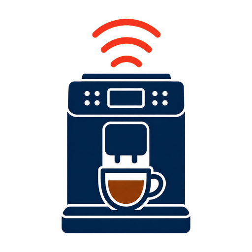

# De'Longhi Coffee Link – Eletta Explore for Home Assistant

  

An independent, cloud-connected Home Assistant custom integration for De'Longhi
Eletta Explore coffee machines connected through Coffee Link and the Ayla IoT
platform. It combines near-real-time cloud push with an automatic polling fallback.

> [!CAUTION]
> Remote preparation can dispense hot liquid or steam. Keep a suitable cup in
> place, attach the correct accessory and check the area around the machine.
> Never use remote preparation when the appliance cannot be supervised.

## Project status

| Item | Status |
|---|---|
| Current release | 1.2.1; installed through HACS and verified to load on the target Home Assistant |
| Prerelease | 1.3.0-beta.9 candidate; automated validation, public CI and target-HA live acceptance passed |
| Physical command acceptance | 1.3.0-beta.6; supervised Wake, Cold Brew Start/Stop and Standby passed on the verified Eletta |
| Verified machine | Eletta Explore ECAM450.65.G (`DL-striker-cb`, EU region) |
| Home Assistant | 2026.8.2 or newer |
| Languages | English and Czech |
| Automated tests | 391 isolated tests at 100% line/branch coverage + 3 actual Home Assistant runtime tests |
| Distribution | HACS custom repository or manual installation from a GitHub release; default-catalog review is pending |

The PrimaDonna Soul profile remains available for compatibility testing, but it
has not completed the same physical acceptance matrix and is therefore
experimental. See [Compatibility and known limitations](docs/COMPATIBILITY.md).

## Features

- UI-based account setup, reauthentication, reconfiguration and multi-device
  discovery.
- Automatic reload when a coffee maker is added to or removed from the Coffee
  Link account, including cleanup of stale entity and device registry entries.
- Machine state, cloud connectivity and maintenance-condition entities.
- Near-real-time Ayla DSS state updates and, on cloud properties that declare
  ACK support, exact datapoint acknowledgements; protected by event ordering and
  an automatic 30-second polling fallback. Eletta's non-ACK command channel is
  confirmed from the resulting machine state, matching Coffee Link behavior.
- Cooperative device-to-cloud snapshot refresh: after startup, hourly and after
  completed beverage commands. It follows Coffee Link's safe refresh request,
  defers to active work or foreign sessions and never starts a beverage or wakes
  the appliance.
- Beverage, water, filter, descaling and grounds-container statistics with
  appropriate Home Assistant units and state classes.
- Model-aware Coffee Link summary formulas: Eletta/Striker and the legacy
  PrimaDonna Soul layout map to the same semantic entities without guessing on
  unknown machines. Per-recipe counters remain available but are disabled by
  default for newly registered entities.
- Stable maintenance alarms that ignore transient startup and shutdown frames.
- Dynamic beverage buttons learned from commands produced by the official
  Coffee Link app.
- Wake, standby, statistics refresh and context-aware Stop controls.
- Serialized cloud commands, session-conflict detection and acknowledgement
  tracking.
- Pre-brew checks for cloud availability, machine readiness, water tank and
  grounds container.
- CRC, command identity and device-signature validation before learned commands
  are stored or replayed.
- Serialized refresh-token recovery and bounded retries for temporary cloud
  failures without treating an expired session or outage as a wrong password.
- Privacy-safe downloadable diagnostics with credentials, device identifiers and
  raw command frames removed.
- English/Czech entity, state, exception and Repairs translations with icons
  provided through Home Assistant's current icon-translation mechanism.

The **Coffee Link Session** entity reports whether the exclusive command session
is free, uses the machine's shared Coffee Link identifier or uses a different
identifier. The shared identifier cannot distinguish this integration from the
official app, so its neutral state is **Active**. **Last Command Status**
records only commands issued by Home Assistant; traffic observed from the official
app is kept separate in diagnostics.

Home Assistant applies an entity's enabled-by-default setting only when it is
first registered. Updating to the beta does not disable counters that an existing
installation already has enabled. They can be managed individually under the
device's **Entities** page.

## Installation

### HACS (recommended)

Until the repository is included in the default HACS catalog, add it once as a
custom repository:

The [default-catalog request](https://github.com/hacs/default/pull/10136) is
currently in the HACS review queue.

1. Open HACS and choose **Custom repositories**.
2. Add
   `https://github.com/kasiom/ha-delonghi-coffeelink-eletta-explore`
   with category **Integration**. The badge above opens the same repository
   directly when My Home Assistant is configured.
3. Install **De'Longhi Coffee Link – Eletta Explore** and restart Home Assistant.
4. Open **Settings → Devices & services → Add integration** and search for
   **De'Longhi Coffee Link – Eletta Explore**.

### Manual installation

Download the latest GitHub release, copy the complete
`custom_components/ha_delonghi_coffeelink_eletta_explore` directory to
`/config/custom_components/`, restart Home Assistant and add the integration
through the UI. Never mix files from different releases.

Detailed installation, update and removal instructions are in
[Installation and updates](docs/INSTALLATION.md).

## Learning beverage controls

Eletta Explore recipe commands contain model-specific settings and a device
signature. The integration learns the exact command generated by Coffee Link,
validates it, stores it locally in Home Assistant and creates a matching button.

1. Keep Home Assistant and the integration running.
2. Prepare the required drink once from the official Coffee Link app.
3. Wait for the DSS update; if the stream is unavailable, polling fallback normally
   discovers it within 30 seconds.
4. Reload the integration only if the new button does not appear automatically.

Learning the same recipe again replaces the previous frame. A command with an
invalid checksum, recipe identity, action or device signature is rejected.
Stop is available only while the integration knows both the active beverage and
its validated Stop frame. If a previously stored frame fails validation, Home
Assistant creates an actionable **Repairs** item and removes it automatically
after every discarded command has been learned again.

## Documentation

- [Český přehled](docs/README_CS.md)
- [Installation and updates](docs/INSTALLATION.md)
- [Usage and safety](docs/USAGE.md)
- [Cloud snapshot refresh](docs/CLOUD_SNAPSHOT_REFRESH.md)
- [Obnova cloudového snímku – česky](docs/CLOUD_SNAPSHOT_REFRESH_CS.md)
- [Compatibility and known limitations](docs/COMPATIBILITY.md)
- [Troubleshooting](docs/TROUBLESHOOTING.md)
- [Privacy and cloud data](docs/PRIVACY.md)
- [Architecture and provenance](docs/ARCHITECTURE.md)
- [Current technical audit](docs/TECHNICAL_AUDIT.md)
- [Maintainer release process](docs/RELEASING.md)
- [Quality-scale self-assessment](custom_components/ha_delonghi_coffeelink_eletta_explore/quality_scale.yaml)
- [MonitorV2 protocol map](docs/MONITOR_V2_CODE_MAP.md)
- [Security policy](SECURITY.md)
- [Changelog](CHANGELOG.md)

## Support and contributions

Use the supplied issue forms for reproducible bug reports and feature requests.
Before publishing diagnostics or logs, remove credentials, e-mail addresses,
serial numbers, DSNs, tokens and raw command frames. See
[CONTRIBUTING.md](CONTRIBUTING.md).

## License and disclaimer

This project is unofficial and is not affiliated with, supported by or endorsed
by De'Longhi. De'Longhi and Coffee Link are trademarks of their respective
owner. Operation depends on an undocumented vendor cloud and reverse-engineered
protocol; vendor changes can interrupt functionality.

The source is distributed under the [MIT License](LICENSE). Original MIT
attribution is retained. This is a standalone project, not a GitHub fork or the
update channel for another integration. Sources and acknowledgements are listed
in [Architecture and provenance](docs/ARCHITECTURE.md).
